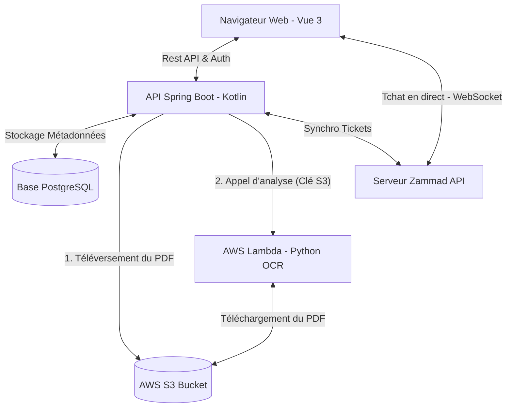

# 📁 DocManager (SmartDocs)

**DocManager** est une plateforme professionnelle et unifiée de gestion de documents comptables et financiers, combinée à un système de support client intelligent. 

Ce projet est issu de la fusion et de la communication entre deux systèmes complémentaires :
1. **L'Analyse de Documents Comptables :** Un moteur intelligent en Python/FastAPI chargé de lire, classifier et extraire les métadonnées clés des documents financiers sous forme structurée.
2. **Le Ticketing & Support :** Un service client intégré exploitant l'API de Zammad, offrant un suivi des requêtes de support et un tchat en direct.

---

## 🎯 Objectif du Projet

L'objectif principal de **DocManager** est d'offrir aux entreprises un **système centralisé d'archivage sécurisé** assorti d'un **moteur de recherche multicritère performant**. Il permet de :
* Décharger les équipes comptables de la saisie manuelle grâce à l'extraction automatique d'informations.
* Structurer l'ensemble des factures, bilans et pièces comptables au format standardisé JSON.
* Fournir une vue d'ensemble (pour les administrateurs) et des espaces privés (pour les utilisateurs) facilitant la recherche par année, type de document, mots-clés ou par client.
* Résoudre rapidement les incidents ou demandes de support en direct depuis l'application via un tchat et un suivi des tickets d'assistance.

---

## ⚙️ Architecture Globale & Communication



### 1. Archivage S3 & Moteur d'Analyse Serverless (`AWS Lambda`)
Lorsqu'un utilisateur téléverse un document PDF (facture, bilan, etc.) sur la plateforme :
* Le backend Kotlin stocke directement le fichier physique dans un compartiment **AWS S3** sécurisé avec un identifiant unique (UUID).
* Le backend appelle ensuite la fonction **AWS Lambda** (qui contient notre moteur Python packagé dans un conteneur Docker). Il lui transmet simplement le nom du bucket et la clé S3 du document.
* La Lambda télécharge le fichier depuis S3 en mémoire temporaire, extrait le texte avec Tesseract OCR et Poppler, structure les données financières en **JSON** (TVA, montant total, dates, type de document) et renvoie le résultat au backend.
* Ces données structurées sont enfin enregistrées dans la base de données PostgreSQL locale pour indexation et recherche.

### 2. Archivage & Système de Recherche Multicritère
* **Archivage :** Les fichiers PDF originaux sont conservés de manière durable dans le Cloud sur AWS S3, tandis que les métadonnées et le JSON extrait sont historisés dans la base PostgreSQL locale.
* **Recherche :** Un moteur de recherche côté serveur permet aux utilisateurs et aux administrateurs de filtrer les documents instantanément :
  * Par **Année** (2022 à 2026).
  * Par **Type** (Invoice, Balance Sheet, etc.).
  * Par **Recherche textuelle libre** (recherche de valeurs à l'intérieur du JSON extrait).
  * Par **Utilisateur / Client** (Exclusif aux administrateurs via un champ de recherche intelligent par autocomplétion).


### 3. Support Client & Intégration Zammad
* **Formulaire d'Assistance :** Un bouton "Report a Problem" permet d'ouvrir un formulaire Zammad dynamique pour soumettre des tickets directement sur le groupe de support Zammad.
* **Tchat en direct :** Un tchat client WebSocket Zammad est injecté en bas de l'écran pour initier des conversations instantanées avec des agents de support en direct.
* **Suivi des Tickets :** L'application communique avec l'API Zammad pour lister l'historique des tickets ouverts pour chaque client et leur statut en temps réel (Open, Closed, New). Si Zammad est indisponible, l'application continue de fonctionner de manière robuste (une alerte est affichée et la déconnexion automatique est évitée).


---

## 🚀 Technologies Utilisées

* **Frontend :** Vue 3, TypeScript, Vite, Vanilla CSS (Design sombre premium, verre/glassmorphism, animations fluides).
* **Backend :** Kotlin, Spring Boot 4, Spring Security (Authentification Stateless par Token), Spring Data JPA.
* **Services Cloud AWS :** 
  * **AWS S3** : Stockage d'archivage des documents PDF.
  * **AWS Lambda** : Moteur d'analyse OCR Python exécuté de manière serverless (Conteneur ECR).
  * **AWS ECR (Elastic Container Registry)** : Stockage privé de l'image Docker de la Lambda.
  * **AWS IAM** : Gestion des droits d'accès.
* **Moteur d'Analyse (Lambda) :** Python 3.11, Tesseract OCR, Poppler (pdftoppm), pdfplumber, Pillow.
* **Base de données :** PostgreSQL.
* **Outil Support :** Zammad (API REST + WebSocket).

---

## ☁️ Déploiement du Moteur d'Analyse (AWS Lambda)

Le moteur d'analyse Python contient des dépendances système complexes (Tesseract OCR, Poppler). Il est donc packagé dans une image Docker Debian et déployé sur AWS Lambda en tant qu'image de conteneur.

### 1. Compilation et Envoi de l'image Docker vers AWS ECR
Ouvrez un terminal dans le dossier `Analyse-de-documents-comptables/` :
```powershell
# 1. Se connecter à AWS ECR (remplacer par votre ID de compte et région)
aws ecr get-login-password --region <region> | docker login --username AWS --password-stdin <id-compte>.dkr.ecr.<region>.amazonaws.com

# 2. Créer le dépôt ECR si inexistant
aws ecr create-repository --repository-name docmanager-analyzer

# 3. Compiler l'image sans cache et sans métadonnées de provenance (obligatoire pour Lambda)
docker build --no-cache --provenance=false --platform linux/amd64 -t docmanager-analyzer .

# 4. Taguer et pousser l'image
docker tag docmanager-analyzer:latest <id-compte>.dkr.ecr.<region>.amazonaws.com/docmanager-analyzer:latest
docker push <id-compte>.dkr.ecr.<region>.amazonaws.com/docmanager-analyzer:latest
```

### 2. Création et Configuration de la fonction Lambda
1. Créez une fonction Lambda sur la Console AWS en choisissant **Image de conteneur** (Container Image).
2. Nommez-la `docmanager-analyzer` et sélectionnez l'image poussée sur ECR.
3. **Paramètres généraux (Configuration) :**
   * Changez le **Timeout (Délai d'expiration)** à **2 minutes**.
   * Augmentez la **Mémoire (RAM)** à **1024 Mo** ou **2048 Mo**.
4. **Permissions (IAM) :**
   * Cliquez sur le rôle d'exécution de la Lambda et ajoutez-lui la stratégie **`AmazonS3ReadOnlyAccess`** pour qu'elle puisse lire les documents stockés dans S3.

---

## 🛠️ Configuration & Lancement du Projet

### Prérequis
* Java 21+ (pour le backend)
* Node.js 18+ (pour le frontend)
* Docker Desktop (pour le stockage local et le build de la Lambda)

### 1. Configurer et Lancer le Backend (Spring Boot)
1. Créez un fichier `.env` dans `./backend` contenant :
   ```env
   # Zammad API Configuration
   ZAMMAD_API_URL=http://localhost:8080/api/v1
   ZAMMAD_API_TOKEN=votre_token_zammad

   # Database Configuration
   DB_URL=jdbc:postgresql://localhost:5439/appdb
   DB_USERNAME=admin
   DB_PASSWORD=admin

   # AWS Configuration (IAM Utilisateur ayant les accès S3 et Lambda)
   AWS_ACCESS_KEY=votre_aws_access_key
   AWS_SECRET_KEY=votre_aws_secret_key
   AWS_REGION=eu-west-3
   AWS_BUCKET_NAME=nom_de_votre_bucket_s3
   ```
2. Lancez la base de données locale (PostgreSQL) via Docker Compose :
   ```bash
   docker compose up -d postgres
   ```
3. Démarrez l'application Kotlin :
   ```bash
   cd ./backend
   ./gradlew bootRun
   ```

### 2. Lancer le Frontend (Vue 3)
1. Accédez au dossier `frontend` :
   ```bash
   cd ./frontend
   ```
2. Installez les dépendances et lancez le serveur de développement Vite :
   ```bash
   npm install
   npm run dev
   ```
