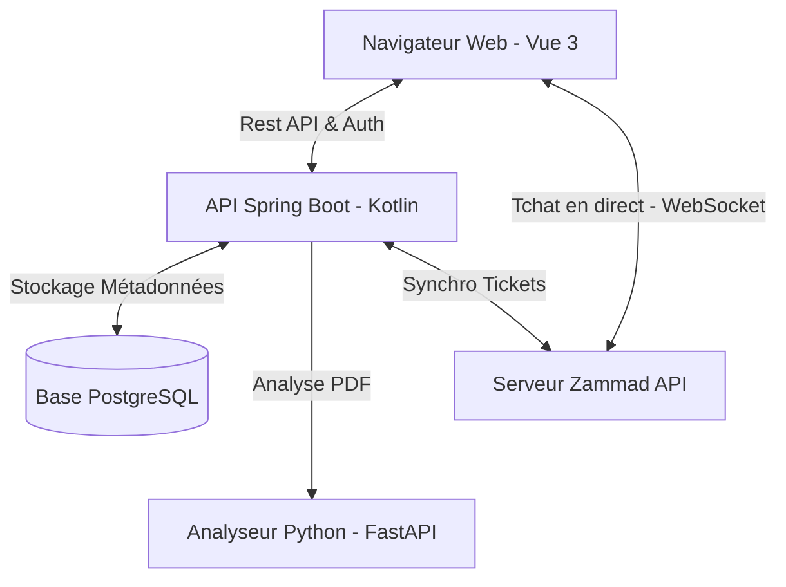

# 📁 DocManager (SmartDocs)

**DocManager** est une plateforme professionnelle et unifiée de gestion de documents comptables et financiers, combinée à un système de support client intelligent. 

Ce projet est issu de la fusion et de la communication entre deux systèmes complémentaires :
1. **L'Analyse de Documents Comptables :** Un moteur intelligent en Python/FastAPI chargé de lire, classifier et extraire les métadonnées clés des documents financiers sous forme structurée.
2. **Le Ticketing & Support :** Un service client intégré exploitant l'API de Zammad, offrant un suivi des requêtes de support et un tchat en direct.

---

## 🎯 Objectif du Projet

L'objectif principal de **DocManager** est d'offrir aux entreprises un **système centralisé d'archivage sécurisé** assorti d'un **moteur de recherche multicritère performant**. Il permet de :
* Décharger les équipes comptables de la saisie manuelle grâce à l'extraction automatique d'informations.
* Structurer l'ensemble des factures, bilans et pièces comptables au format standardisé JSON.
* Fournir une vue d'ensemble (pour les administrateurs) et des espaces privés (pour les utilisateurs) facilitant la recherche par année, type de document, mots-clés ou par client.
* Résoudre rapidement les incidents ou demandes de support en direct depuis l'application via un tchat et un suivi des tickets d'assistance.

---

## ⚙️ Architecture Globale & Communication



### 1. Extraction de Données & Moteur Python (`FastAPI`)
Lorsqu'un utilisateur téléverse un document PDF (facture, bilan, etc.) sur la plateforme :
* Le backend Kotlin transfère le flux binaire à l'**Analyseur Python**.
* L'analyseur extrait le texte brut, identifie le type de document (par exemple : *Facture*, *Bilan*, *Inconnu*) et structure les champs financiers découverts en données complexes **JSON** (TVA, montant total, dates, etc.).
* Ces données structurées sont renvoyées au backend, qui les enregistre dans la base de données PostgreSQL à des fins d'indexation et de recherche.

### 2. Archivage & Système de Recherche Multicritère
* **Archivage :** Les fichiers PDF originaux sont conservés en toute sécurité sur disque, tandis que les métadonnées et le JSON extrait sont historisés dans la base PostgreSQL.
* **Recherche :** Un moteur de recherche côté serveur permet aux utilisateurs et aux administrateurs de filtrer les documents instantanément :
  * Par **Année** (2022 à 2026).
  * Par **Type** (Invoice, Balance Sheet, etc.).
  * Par **Recherche textuelle libre** (recherche de valeurs à l'intérieur du JSON extrait).
  * Par **Utilisateur / Client** (Exclusif aux administrateurs via un champ de recherche intelligent par autocomplétion).

### 3. Support Client & Intégration Zammad
* **Formulaire d'Assistance :** Un bouton "Report a Problem" permet d'ouvrir un formulaire Zammad dynamique pour soumettre des tickets directement sur le groupe de support Zammad.
* **Tchat en direct :** Un tchat client WebSocket Zammad est injecté en bas de l'écran pour initier des conversations instantanées avec des agents de support en direct.
* **Suivi des Tickets :** L'application communique avec l'API Zammad pour lister l'historique des tickets ouverts pour chaque client et leur statut en temps réel (Open, Closed, New).

---

## 🚀 Technologies Utilisées

* **Frontend :** Vue 3, TypeScript, Vite, Vanilla CSS (Design sombre premium, verre/glassmorphism, animations fluides).
* **Backend :** Kotlin, Spring Boot 3, Spring Security (Authentification Stateless par Token), Spring Data JPA.
* **Moteur d'Analyse :** Python 3, FastAPI, extracteurs de champs PDF.
* **Base de données :** PostgreSQL.
* **Outil Support :** Zammad (API REST + WebSocket).

---

## 🛠️ Configuration & Lancement du Projet

### Prérequis
* Java 17+ (pour le backend)
* Node.js 18+ (pour le frontend)
* Python 3.10+ (pour le moteur d'analyse)
* Une instance PostgreSQL active

### 1. Lancer l'Analyseur Python
1. Accédez au dossier `Analyse-de-documents-comptables` :
   ```bash
   cd ./Analyse-de-documents-comptables
   ```
2. Installez les dépendances :
   ```bash
   pip install -r requirements.txt
   ```
3. Démarrez le serveur FastAPI (écoute par défaut sur le port `8000`) :
   ```bash
   uvicorn src.main:app --reload
   ```

### 2. Configurer et Lancer le Backend (Spring Boot)
1. Créez un fichier `.env` dans `./backend` (ou utilisez le [.env.example](file:///c:/Users/samir/Desktop/DocManager/backend/.env.example) fourni) contenant :
   ```env
   DB_URL=jdbc:postgresql://localhost:5432/appdb
   DB_USERNAME=votre_utilisateur
   DB_PASSWORD=votre_mot_de_passe
   ZAMMAD_API_URL=http://localhost:8080/api/v1
   ZAMMAD_API_TOKEN=votre_token_zammad
   ```
2. Lancez l'application Kotlin :
   ```bash
   cd ./backend
   ./gradlew bootRun
   ```

### 3. Lancer le Frontend (Vue 3)
1. Accédez au dossier `frontend` :
   ```bash
   cd ./frontend
   ```
2. Installez les paquets NPM :
   ```bash
   npm install
   ```
3. Démarrez le serveur de développement Vite (généralement accessible sur `http://localhost:5173`) :
   ```bash
   npm run dev
   ```
